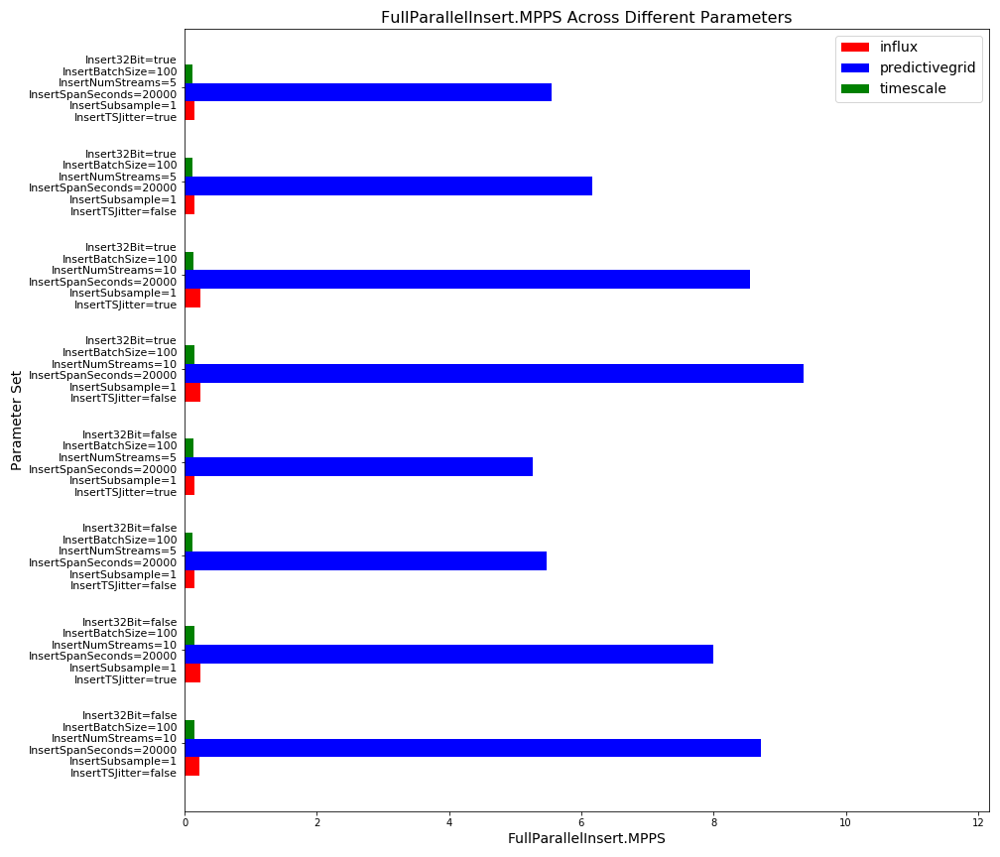
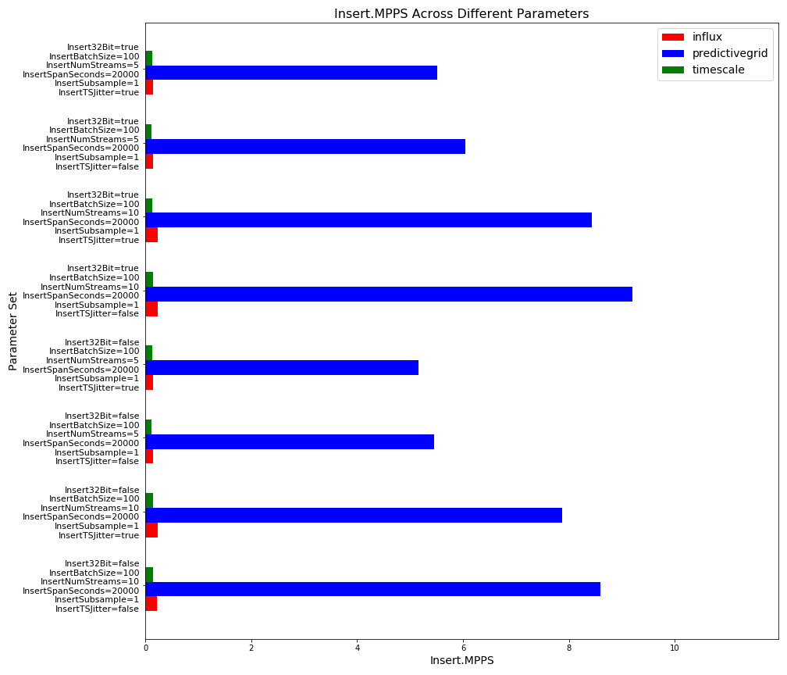
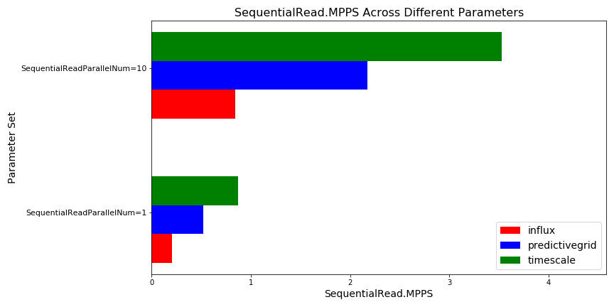
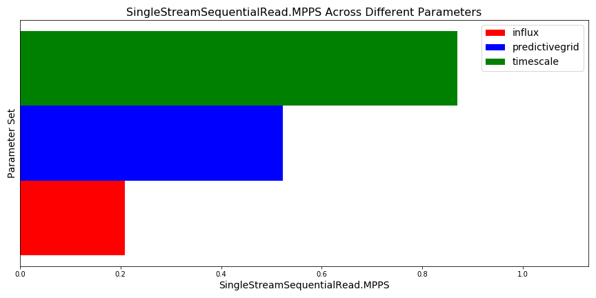
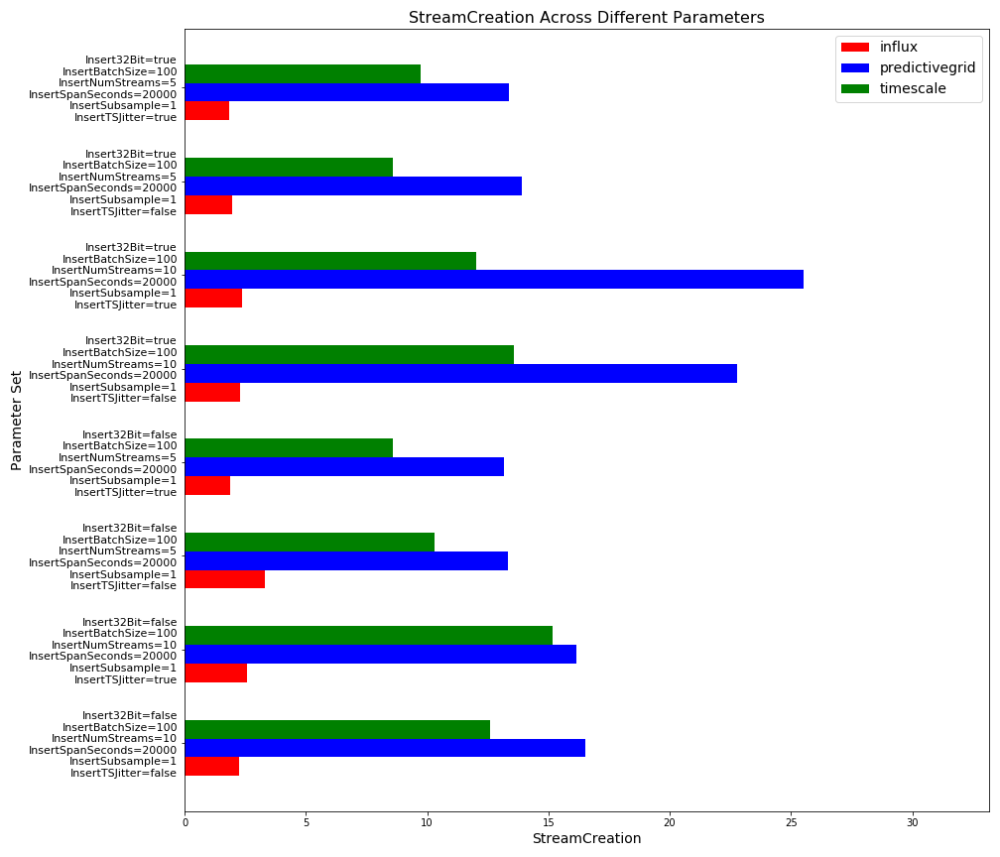

# Time series benchmarking report

## Overview

There are many time series databases on the market at the moment and they each have their own strengths and weaknesses. Some of these characteristics are qualitative or can be quantified without an experiment for example "this database can scale out to a cluster" or "this database supports query X". Others need an experiment run on controlled hardware in order to quantify the differences.

Using the benchmarking codebase in this repository, we evaluate a number of scenarios to model real world performance.  Below you will find the results of our most recent round of benchmarking...

## Parallel Inserts

In the below plot, FullParallelInsert.MPPS (shown along the x axis) is compared across the databases: influx, predictivegrid, and timescale. The parameters: SequentialReadParallelNum, InsertNumStreams, InsertSpanSeconds, Insert32Bit, InsertSubsample, InsertTSJitter, and InsertBatchSize were controlled for and are given along the y axis.

## Insert

In the below plot, Insert.MPPS (shown along the x axis) is compared across the databases: influx, predictivegrid, and timescale. The parameters: SequentialReadParallelNum, InsertNumStreams, InsertSpanSeconds, Insert32Bit, InsertSubsample, InsertTSJitter, and InsertBatchSize were controlled for and are given along the y axis.

## Full Parallel Sequential Read

In the below plot, FullParallelSequentialRead.MPPS (shown along the x axis) is compared across the databases: influx, predictivegrid, and timescale. The parameters: SequentialReadParallelNum, InsertNumStreams, InsertSpanSeconds, Insert32Bit, InsertSubsample, InsertTSJitter, and InsertBatchSize were controlled for and are given along the y axis.

## Sequential Read

In the below plot, SequentialRead.MPPS (shown along the x axis) is compared across the databases: influx, predictivegrid, and timescale. The parameters: SequentialReadParallelNum, InsertNumStreams, InsertSpanSeconds, Insert32Bit, InsertSubsample, InsertTSJitter, and InsertBatchSize were controlled for and are given along the y axis.

## Single Stream Sequential Read

In the below plot, SingleStreamSequentialRead.MPPS (shown along the x axis) is compared across the databases: influx, predictivegrid, and timescale. The parameters: SequentialReadParallelNum, InsertNumStreams, InsertSpanSeconds, Insert32Bit, InsertSubsample, InsertTSJitter, and InsertBatchSize were controlled for and are given along the y axis.

## Stream Creation

In the below plot, StreamCreation (shown along the x axis) is compared across the databases: influx, predictivegrid, and timescale. The parameters: SequentialReadParallelNum, InsertNumStreams, InsertSpanSeconds, Insert32Bit, InsertSubsample, InsertTSJitter, and InsertBatchSize were controlled for and are given along the y axis.

